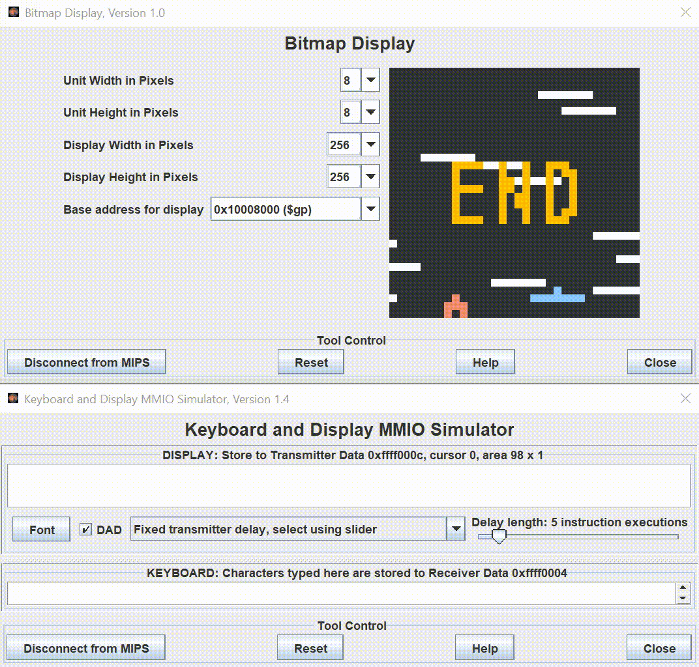

# bounce

> bounce is a MIPS assembly game modelled after [`doodle jump.`](https://en.wikipedia.org/wiki/Doodle_Jump)

## Usage

Assembler & Runtime Simulator: [`MARS 4.5+`](http://courses.missouristate.edu/kenvollmar/mars/download.htm)

Connect & configure the bitmap display & keyboard to the specifications displayed

- Unit Width: `8px`
- Unit Height: `8px`
- Display Width: `256px`
- Display Height: `256px`
- Base Address: `0x10008000 ($gp)`

Compile and Run the code to get started with the game

Actions are taken with specific keyboard commands typed into the keyboard MMIO Simulator

- `s` : Reset Game
- `j` : Move Left
- `k` : Move Right

## Features

- Gameplay gets faster as the doodler gets higher
- Blue platforms give a boosted jump
- Jump is modeled after a parabola for gravity acceleration

## Built With

- MARS 4.5

